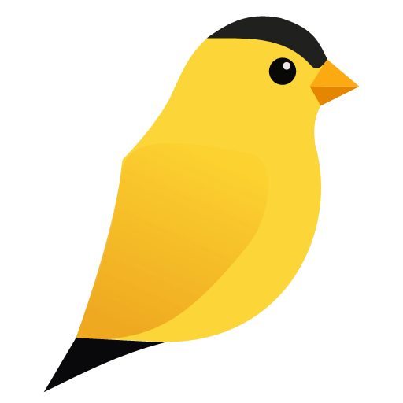

<h1 align="center">Foldfinch</h1>
<p align="center">
 
</p>

<p align="center">
<strong>PDF chores made easy.</strong>
</p>

<br>

Foldfinch is a small, fast **Windows and macOS** desktop app for the everyday PDF jobs that
shouldn't need a subscription — dropping a page, stitching files together, fixing a sideways scan.
Open your PDFs, drag pages around, and save a clean copy. Your originals are never touched.

- **Remove pages** from a PDF
- **Combine** multiple PDFs into one
- **Reorder pages** graphically (drag and drop)
- **Rotate pages**

Already know you want it? [Skip to install ▼](#install)

## What you can do

- **Open and combine** — add one PDF or several at once. A central **Add PDF** button appears when
  nothing is open; once you have pages, a faint **+** before every page (and after the last one)
  lets you insert more PDFs at exactly that spot. Pages from different files get a colour-coded
  source chip so you always know where each one came from.
- **Reorder by dragging** — pick pages up and drop them where you want, with a live drop-position
  indicator. Multi-select with click, Ctrl+click, and Shift+click.
- **Remove pages** — select the pages you don't want and delete them.
- **Rotate** — turn the selection clockwise or counter-clockwise; thumbnails update to the correct
  aspect ratio immediately.
- **Undo/redo everything** — multi-level history for every edit.
- **Save safely** — **Save As** always prompts for a new destination, so your source files are
  never modified in place. Close with unsaved changes and Foldfinch offers to save, discard, or cancel.

Light theme by default — PDFs are usually white.

### Handy shortcuts

| Action | Shortcut |
| --- | --- |
| Select all | `Ctrl+A` |
| Remove selected | `Delete` |
| Undo / Redo | `Ctrl+Z` / `Ctrl+Y` |
| Rotate CW / CCW | `Ctrl+R` / `Ctrl+Shift+R` |

## Install

Grab the build for your platform from the [latest release](https://github.com/ArcticGizmo/foldfinch/releases/latest).

### Windows

Download `Foldfinch-win-Setup.exe` and run it.

- No admin rights required — installs to `%LocalAppData%\Foldfinch\`
- Starts automatically after install
- Adds a Start Menu shortcut and a standard uninstaller (Settings → Apps)

### macOS (unsigned)

1. Download the package for your Mac — **`Foldfinch-osx-arm64-Setup.pkg`** on Apple Silicon (M-series)
   Macs, or **`Foldfinch-osx-x64-Setup.pkg`** on Intel ones.
2. Open it and drag **Foldfinch** to your **Applications** folder.
3. Clear the quarantine flag (see below), then launch Foldfinch from Applications.

The mac build is **not yet code-signed or notarized**. When macOS downloads an unsigned app it tags
it with a `com.apple.quarantine` flag, and Gatekeeper then refuses to open it — showing
**"Foldfinch is damaged and can't be opened. You should move it to the Trash."** The app isn't
actually damaged; that misleading message just means the quarantine flag is set. Remove it once,
from **Terminal**:

```sh
xattr -cr /Applications/Foldfinch.app
```

Then open Foldfinch normally. You only need to do this once per install/update. If you dragged it
somewhere other than `/Applications`, point the command at wherever `Foldfinch.app` actually lives.

## Updating

Open **About** from within the app and use the manual update check — Foldfinch downloads the latest
release and restarts into it. You'll also see an update-available notice on launch when a newer
version is out, and a "what's new" summary after updating.

---

# Development

The rest of this document is for building and hacking on Foldfinch.

## Running

Requirements: **.NET 10 SDK**.

```
dotnet run --project src/Foldfinch.App
```

or on Windows, `run.bat`.

## Layout

| Project | Purpose |
| --- | --- |
| `src/Foldfinch.Core` | PDF logic (open, remove, combine, reorder, rotate, save). No UI dependency. |
| `src/Foldfinch.App` | Avalonia MVVM desktop UI. |
| `tests/Foldfinch.Tests` | xUnit tests. |

The UI is [Avalonia](https://avaloniaui.net/). See
[`docs/implementation-plan.md`](docs/implementation-plan.md) for the milestone plan.

## Tests

```
dotnet test
```

## Icons

The app's logo lives in a single source-of-truth vector file, [`foldfinch.svg`](./foldfinch.svg).
Every raster asset — the window/toolbar icon, the `.exe` icon, and the README header — is generated
from it, so the icon stays crisp at any size and there's only one file to edit.

After changing `foldfinch.svg`, regenerate the assets and commit the results:

```
powershell tools/gen-icons.ps1   # PowerShell
tools\gen-icons.cmd              # cmd
# or directly: dotnet run --project tools/IconGen
```

This writes `src/Foldfinch.App/Assets/foldfinch.png` (256×256), `src/Foldfinch.App/Assets/foldfinch.ico`
(multi-resolution), and `landing-icon.png` (512×512). The SVG is rendered through System.Drawing,
which only runs on Windows.

## Building a release (maintainers)

Releases are created by pushing a version tag. GitHub Actions ([`.github/workflows/release.yml`](.github/workflows/release.yml))
builds a self-contained, [Velopack](https://velopack.io/)-packed installer for each platform
(`win-x64`, `osx-arm64`, `osx-x64`) and uploads them to the matching GitHub Release. PDFium/SkiaSharp
native assets are pulled in per-RID by the publish.

**Steps:**

1. Bump `<Version>` in `src/Foldfinch.App/Foldfinch.App.csproj` to the new version (e.g. `0.2.0`).
2. Add a matching section to [`CHANGELOG.md`](CHANGELOG.md) — the app embeds it and shows what's new
   after an update.
3. Commit the changes.
4. Push a matching tag:
   ```
   git tag v0.2.0
   git push origin v0.2.0
   ```
5. GitHub Actions builds, packs, and uploads the installers to the release page.

Users then get the new version via the in-app update check.

> **Note:** the in-app update check reads its feed from the `FOLDFINCH_UPDATE_FEED` environment
> variable (a release-feed URL or directory) and is a no-op when unset or when the app wasn't
> installed via Velopack.

## Credits

PDF manipulation by [PDFsharp](https://www.pdfsharp.net/) (MIT), rendering by
[PDFtoImage](https://github.com/sungaila/PDFtoImage) → PDFium (BSD-3-Clause) + SkiaSharp (MIT).
See [`THIRD-PARTY-NOTICES.md`](THIRD-PARTY-NOTICES.md).
